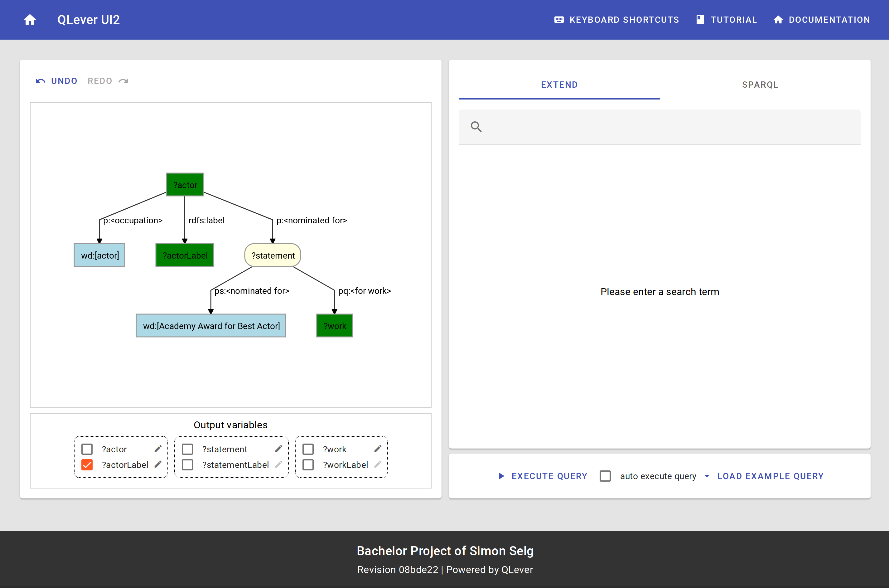

# QLever UI2

 QLever UI2 is a web-application which provides an intuitive, graphical way to construct and visualize queries against wikidata. It enables users to dive into the world of knowledgebases, without having to know the SPARQL query language.

QLever UI2 is the bachelor project I did at the [Chair of Algorithms and Data Structures of Prof. Dr. Hannah Bast](https://ad.informatik.uni-freiburg.de/front-page-en?set_language=en) as part of my computer science studies at the [Albert-Ludwigs-Universität Freiburg](https://www.uni-freiburg.de/). It was supervised by [Prof. Hannah Bast](https://ad.informatik.uni-freiburg.de/staff/bast)

## Demo
You can checkout my [hosted instance of qlever-ui2](https://qlever-ui2.c137.selg.me/). The project documentation can be found [here](https://simonselg.github.io/qlever-ui2/).

## Project structure
- The `qlever-ui2-frontend` folder contains the frontend, which is just the UI
- The `qlever-ui2-backend` folder contains the backend service
- The `qlever-ui2-shared` folder contain code that is shared between the frontend and the backend.
- The `qlever-ui2-documentation` folder contains the documentation website.

For more details, have a look the respective modules folders README.

## Getting started
### Requirements
When running inside of a docker container:
 - docker

When running as a stand-alone software
 - nodejs
 - yarn

The backend needs two additional services to work completely. Have a look at the [backend readme](./qlever-ui2-backend/README.md).

### Running inside docker container
- `docker-compose up`

The App will be available on [http://\<machine ip\>:8080](http://machine-ip:8080).

You can adjust settings, such as the port and the backend environment variables in `docker-compose.yaml`.

### Running locally
- `yarn install`
- `yarn dev` to start the dev server

for production:
- `yarn build` to build frontend, shared and backend
- `yarn production` to start production server

The App will be available on [http://\<machine ip\>:8080](http://machine-ip:8080).

## License
The Code is licensed under GNU General Public License v3.0.
